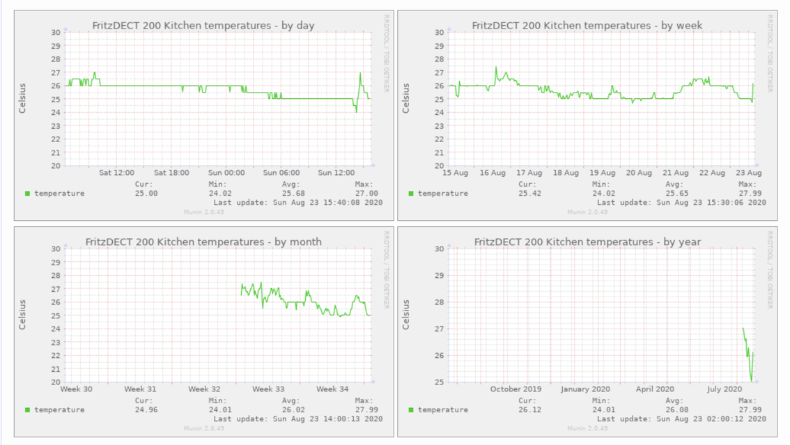

# Simple class to access Fritzbox functions

The provided `FritzAHA` ruby class implements access to the [AVM Home Automation HTTP Interface](https://avm.de/fileadmin/user_upload/Global/Service/Schnittstellen/AHA-HTTP-Interface.pdf) as well as to a small set of standard Fritzbox
functionality.

I started this library as a fun project to integrate my [Fritz!DECT200](https://avm.de/produkte/fritzdect/fritzdect-200/?pk_campaign=SEM-komplett&pk_kwd=FRITZ%21DECT) into [Munin](http://munin-monitoring.org).



The contained script can be used to utilize the implemented functionality, e.g. to toggle the powerswitch

```Text
$ fritzbox -l mylogin -c setswitchtoggle -a ainofswitch
```

The example munin script can be copied to e.g. `/usr/share/munin/plugins/dect200temp` and then simply
create symlinks for the two other functions:

```Text
$ cd /etc/munin/plugins/
$ ln -sf /usr/share/munin/plugins/dect200temp fritzdsl
$ ln -sf /usr/share/munin/plugins/dect200temp dect200power
```

## Caveat(s)

The throughput function only works when the Fritzbox sends the output in german.
I don't know whether and how it is possible to change the language setting of a Fritzbox.
The script `data.lua` accepts a `lang` parameter, but that seems to be ignored, at least
on my box.